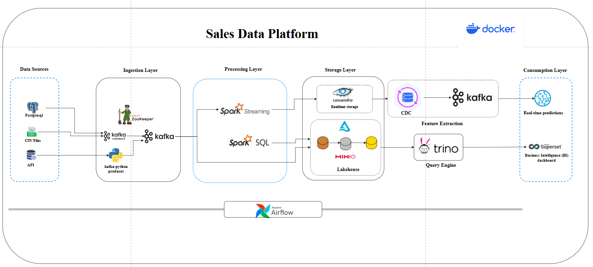

# 🛒 Sales Data Platform

A production-grade end-to-end data platform implementing **Lambda Architecture**, **Data Lakehouse**, and **Medallion Architecture** for real-time and batch sales analytics.

> All services are containerized with **Docker** and orchestrated with **Apache Airflow** (via Astro CLI).
---


## 📐 Architecture Overview

```
Data Sources ──► Ingestion Layer ──► Processing Layer ──► Storage Layer ──► Consumption Layer
  PostgreSQL        Kafka Connect        Spark Streaming      Cassandra (RT)     Real-time ML
  CSV Files         ZooKeeper            Spark SQL            MinIO Lakehouse    Superset BI
  REST API          kafka-python                              CDC / Trino
```

The platform is structured around **5 layers**:

| Layer | Role | Tools |
|---|---|---|
| **Data Sources** | Raw data origins | PostgreSQL, CSV Files, REST API |
| **Ingestion** | Stream ingestion | Apache Kafka, Kafka Connect, ZooKeeper, kafka-python |
| **Processing** | Stream & batch compute | Apache Spark Streaming, Spark SQL |
| **Storage** | Real-time & analytical store | Cassandra, MinIO (Lakehouse), Delta Lake |
| **Consumption** | Querying & visualization | Trino, Apache Superset, Kafka (ML predictions) |

**Orchestration:** Apache Airflow (Astro CLI)  
**Data Catalog:** OpenMetadata

---

## 🗄️ Data Model (Star Schema)

The analytical layer follows a star schema centered on a sales fact table:

- **`fact_ventes`** — sales transactions (`vente_id`, `date_vente`, `client_id`, `produit_id`, `canal_id`, `prix_unitaire`, `quantite`, `montant_ht`, `marge_brute`, `nb_retours`)
- **`dim_client`** — customer dimension (`client_id`, `nom`, `email`, `telephone`, `segment`, `date_inscription`)
- **`dim_produit`** — product dimension (`produit_id`, `code_produit`, `nom`, `marque`, `categorie`, `prix_vente`, `prix_achat`, `poids_g`, `statut`)
- **`dim_canal`** — sales channel dimension (`canal_id`, `code_canal`, `type_canal`, `commission_pct`, `actif`)
- **`dim_date`** — date dimension (`date`, `annee`, `trimestre`, `mois`, `jour_semaine`, `est_weekend`)

---

## 📁 Project Structure

```
sales-data-platform/
├── data/                   # Source data and REST API (FastAPI)
├── ingestion/              # Kafka Connect connector configs (JSON)
├── spark-processing/       # Spark Streaming & SQL jobs (Java/Python)
│   ├── CassandraConfig.java
│   ├── CassandraWriter.java
│   └── resources/schema.cql
├── storage/                # MinIO / Lakehouse configs
├── analytics/              # Trino schemas, Superset dashboards
├── ml_ventes/              # ML models for sales predictions
├── orchestration/          # Airflow DAGs (Astro project)
├── docker/                 # docker-compose.yml and service configs
└── .gitignore
```

---

## 🚀 Getting Started

### Prerequisites

- [Docker](https://www.docker.com/) & Docker Compose
- [Astro CLI](https://docs.astronomer.io/astro/cli/install-cli) (for Airflow)
- Python 3.8+, Java 11+

---

### 1. Start Core Services (Docker)

```bash
cd docker
docker compose up -d
```

This starts: Kafka, ZooKeeper, Kafka Connect, Spark, Cassandra, MinIO, Trino, PostgreSQL, and OpenMetadata.

---

### 2. Start Airflow (Astro)

```bash
# Verify Astro CLI is installed
astro version

# Initialize the Astro project (first time only)
cd orchestration
astro dev init

# Start Airflow
astro dev start
```

---

### 3. Connect Airflow to the Platform Network

Airflow runs in its own container network. Connect it to the platform:

```bash
docker network connect data-platform-network <airflow-container-name>
```

Then configure connections in the **Airflow UI** (`Admin → Connections`):

| Conn ID | Type | Host | Port | Notes |
|---|---|---|---|---|
| `kafka_default` | Generic | `kafka` | `29092` | |
| `spark_default` | Spark | `spark://spark-master` | `7077` | |
| `postgres_default` | Postgres | `postgres` | `5432` | Schema: `data_platform` |
| `minio_s3` | Amazon S3 | — | — | See extra JSON below |
| `trino_default` | HTTP | `trino` | `8080` | |

**MinIO S3 Extra config:**
```json
{
  "aws_access_key_id": "minioadmin",
  "aws_secret_access_key": "minioadmin",
  "endpoint_url": "http://minio:9000"
}
```

---

### 4. Deploy Kafka Connect Connectors

```bash
# PostgreSQL source connectors
curl -X POST http://localhost:8083/connectors \
  -H "Content-Type: application/json" \
  -d @ingestion/postgres-source-clients.json

curl -X POST http://localhost:8083/connectors \
  -H "Content-Type: application/json" \
  -d @ingestion/postgres-source-produits.json

# CSV source connectors
curl -X POST http://localhost:8083/connectors \
  -H "Content-Type: application/json" \
  -d @ingestion/canaux-vente-source.json

curl -X POST http://localhost:8083/connectors \
  -H "Content-Type: application/json" \
  -d @ingestion/retours-source.json

# Verify connector status
curl http://localhost:8083/connectors/postgres-source-clients/status
curl http://localhost:8083/connectors/csv-canaux-vente/status
```

**Expected Kafka topics after deployment:**
```
pg_clients    pg_produits    canaux_vente    retours    ventes    stocks
```

Verify:
```bash
docker exec kafka kafka-topics --bootstrap-server kafka:29092 --list
```

---

### 5. Start the Data Ingestion API

```bash
cd data/data-api
pip3 install fastapi --break-system-packages
uvicorn main:app --reload
```

Then start the Kafka producer:
```bash
pip install kafka-python requests
python3 producer.py
```

---

### 6. Set Up Apache Superset

```bash
cd docker

# Create the Superset database in PostgreSQL
docker exec -it postgres psql -U saifi -d postgres \
  -c "CREATE DATABASE superset_db;"

# Start Superset
docker compose up -d superset
sleep 15

# Initialize schema and create admin user
docker exec -it superset superset db upgrade
docker exec -it superset superset fab create-admin \
  --username admin \
  --firstname Admin \
  --lastname User \
  --email admin@superset.com \
  --password admin

docker exec -it superset superset init
```

Access Superset at **http://localhost:8088** — login: `admin / admin`

---

### 7. Set Up OpenMetadata

```bash
# Create and grant the database
docker exec -it postgres psql -U saifi -d postgres \
  -c "CREATE DATABASE openmetadata_db;"

docker exec -it postgres psql -U saifi -d postgres \
  -c "GRANT ALL PRIVILEGES ON DATABASE openmetadata_db TO saifi;"

# Run migrations
docker exec -it openmetadata bash -c \
  "cd /opt/openmetadata && ./bootstrap/bootstrap_storage.sh migrate-all"

# Verify tables
docker exec -it postgres psql -U saifi -d openmetadata_db -c "\dt" | head -20
```

**PostgreSQL source connection settings:**
- Username: `admin`
- Password: `admin`
- Database: `salesdbsource`

---

## 🔄 Real-Time Data Flow

1. **Sources** (PostgreSQL, CSV, API) → ingested via **Kafka Connect** and `kafka-python` producers
2. **Kafka** buffers all event streams across 6 topics
3. **Spark Structured Streaming** reads from Kafka in real time, applies transformations
4. Processed data is written to **Cassandra** (keyspace: `ventes_platform`) for low-latency reads
5. Batch jobs via **Spark SQL** write to the **MinIO Lakehouse** (Delta/Parquet)
6. **Trino** queries both Cassandra and the Lakehouse for unified analytics
7. **Superset** dashboards connect through Trino for BI visualization
8. **ML models** (`ml_ventes/`) consume Kafka streams for real-time sales predictions

---

## 🛠️ Tech Stack

| Category | Tools |
|---|---|
| **Streaming** | Apache Kafka, ZooKeeper, Kafka Connect |
| **Processing** | Apache Spark (Streaming + SQL), Java |
| **Storage** | Apache Cassandra, MinIO (S3-compatible) |
| **Query Engine** | Trino |
| **Orchestration** | Apache Airflow (Astro CLI) |
| **BI / Visualization** | Apache Superset |
| **Data Catalog** | OpenMetadata |
| **API** | FastAPI (Python) |
| **Containerization** | Docker, Docker Compose |

---

## 📊 Service URLs

| Service | URL | Credentials |
|---|---|---|
| Airflow UI | http://localhost:8080 | (Astro defaults) |
| Superset | http://localhost:8088 | admin / admin |
| Kafka Connect REST | http://localhost:8083 | — |
| MinIO Console | http://localhost:9001 | minioadmin / minioadmin |
| Trino UI | http://localhost:8080 | — |
| Spark Master UI | http://localhost:8181 | — |

---

## 🤝 Contributing

Pull requests are welcome. For major changes, please open an issue first to discuss what you would like to change.

---

## 📄 License

This project is open source. See [LICENSE](LICENSE) for details.